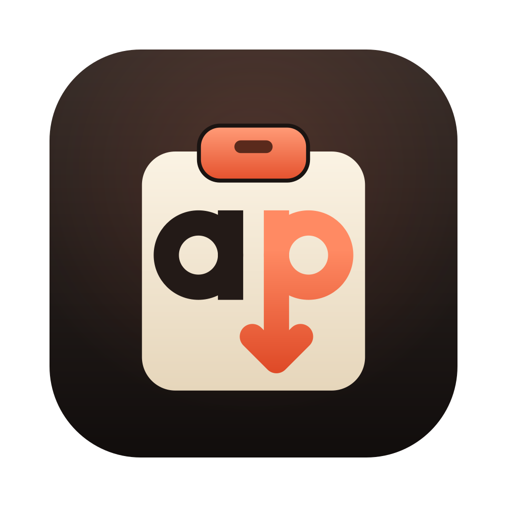
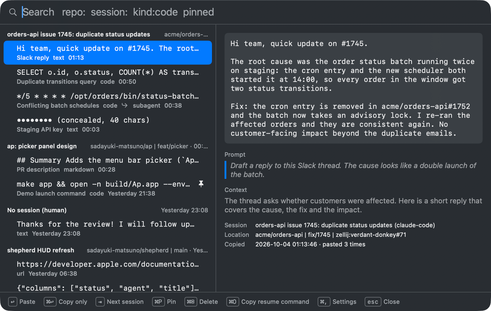
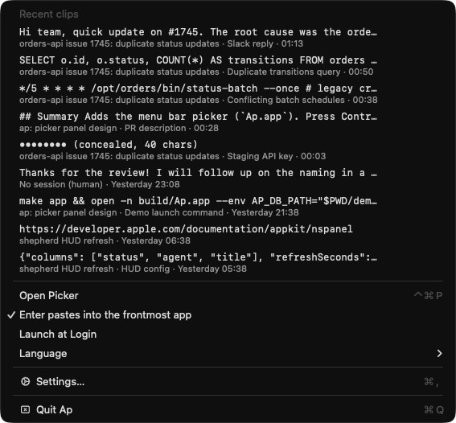
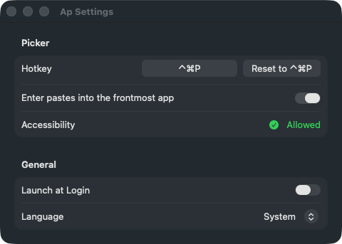
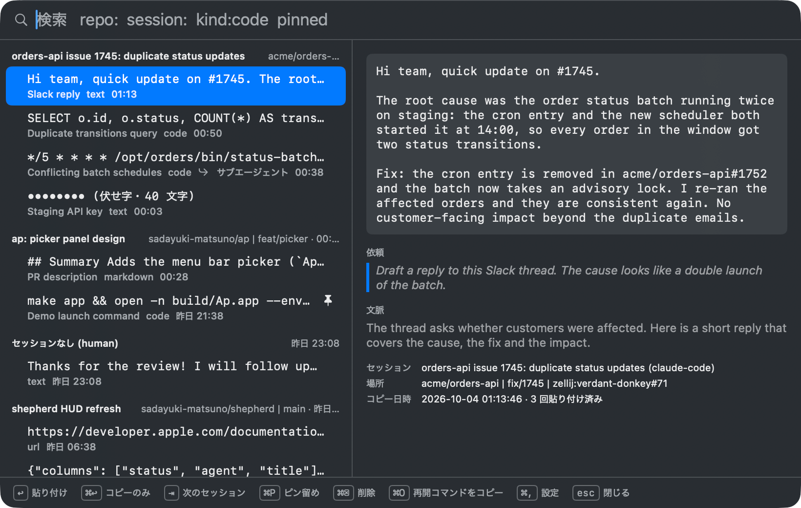
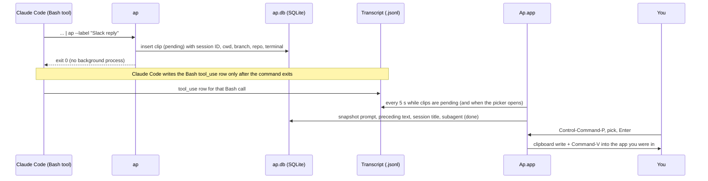

<p align="center">
  
</p>

<h1 align="center">Ap</h1>

A clipboard ledger for AI agents on macOS. Agents pipe text into `ap` instead of `pbcopy`, `ap` remembers *which* [Claude Code](https://claude.com/claude-code) session and *which* request produced each copy, and you paste them from a menu bar picker when you need them.

<p align="center">
  
</p>

```sh
brew install --cask sadayuki-matsuno/tap/ap
```

> Gatekeeper may block the first launch (ad-hoc signature). See [Install](#install).

When an agent hands you a Slack reply, a SQL query and a PR description in one afternoon, they all land on the same clipboard and overwrite each other, and an hour later nobody remembers which session wrote which. Pipe them through `ap` instead: every copy is kept for 24 hours with its session title, repository, branch, the prompt that asked for it and the explanation right before it, and your own clipboard is left alone. Press Control-Command-P anywhere, pick one, and Enter pastes it into the app you were in.

## Features

- **History, not clipboard**: `... | ap` records the text without touching the system clipboard, so agent output never overwrites what you copied yourself. `ap -c` also writes the clipboard like `pbcopy` (UTF-8 safe, unlike `/usr/bin/pbcopy` under a non-UTF-8 locale)
- **Knows where a copy came from**: session ID, agent, cwd, git branch, `owner/name` repository and terminal (Ghostty, zellij session and pane) are captured at copy time
- **Context from the transcript**: the prompt that asked for it, the assistant text right before it and the session title are filled in from the Claude Code transcript, including copies made inside subagents
- **Menu bar picker**: a floating search panel on a global hotkey. Clips grouped by session, the full text, the prompt behind it, and Enter pastes into the app you were in without it ever losing focus
- **Search with filters**: `repo:`, `session:`, `kind:` and `pinned` combine with free text (trigram full-text search over content, label and prompt)
- **Secrets stay quiet**: known token formats (GitHub, `sk-` keys, AWS access keys, private keys, Slack) are detected; lists mask them until you reveal them, and a clipboard write for them is marked concealed for clipboard managers
- **24-hour retention**: older clips are pruned as you copy; pinned clips are kept
- **A real CLI too**: `ap list` (grouped by session, `--json` for scripts and fzf), `ap paste 2`, `ap pin`, `ap delete`, `ap doctor`
- **English and Japanese UI**: follows the macOS language, or pick one in Settings
- **Local only**: one SQLite file (WAL, mode 600). Nothing leaves the machine

## Requirements

- macOS 14 (Sonoma) or later, Apple silicon for the prebuilt app
- To build from source: Swift 6 (Xcode, or just the Command Line Tools: `xcode-select --install`)

## Install

### Homebrew

```sh
brew install --cask sadayuki-matsuno/tap/ap
```

The cask installs `Ap.app` into `/Applications` and links the `ap` CLI (which lives inside the app, in `Ap.app/Contents/MacOS/ap`) onto your PATH. Open Ap once; it stays in the menu bar and can start at login (Settings).

> The prebuilt app is ad-hoc signed (no Apple Developer ID yet), so macOS may refuse the first launch. Click **Open Anyway** in *System Settings > Privacy & Security*, or clear the quarantine flag with `xattr -dr com.apple.quarantine /Applications/Ap.app`. Building from source avoids this entirely.

### From source

```sh
git clone https://github.com/sadayuki-matsuno/ap.git
cd ap
make test
make app                          # builds build/Ap.app (the app plus the ap CLI)
cp -R build/Ap.app /Applications/
open /Applications/Ap.app
ln -sf /Applications/Ap.app/Contents/MacOS/ap ~/.local/bin/ap   # the CLI on your PATH
```

`make install` installs just the CLI (`~/.local/bin/ap`, or `make install PREFIX=/usr/local`) if you don't want the app.

**Signing identity for local builds.** macOS ties the Accessibility grant (needed for Enter to paste) to the app's code signature. An ad-hoc signature changes with every build, so each rebuild would be a new app to macOS and the grant would silently stop working. `make app` therefore signs with a stable identity when it finds one: `$AP_SIGN_IDENTITY`, then a certificate named `ap-dev`, then `shepherd-dev`. Create `ap-dev` once in Keychain Access (*Certificate Assistant > Create a Certificate*, Identity Type *Self Signed Root*, Certificate Type *Code Signing*); a self-signed certificate is enough. Without one, `make app` signs ad hoc and says so.

A prebuilt zip is also attached to each [GitHub Release](https://github.com/sadayuki-matsuno/ap/releases).

## Setup for Claude Code

`ap` only records what is piped into it, so agents have to be told to use it. Add a rule to your global `~/.claude/CLAUDE.md` (and remove any rule that tells Claude to use `pbcopy`):

```md
When you hand me text to paste (a message, a command, a PR description), pipe it to `ap` instead of pbcopy (`... | ap`), and add `--label "<what it is>"` when the purpose is clear. I paste it from the Ap picker (Control-Command-P).
```

Claude Code then copies like this, and the clip shows up in the picker under that session:

```sh
cat <<'EOF' | ap --label "Slack reply"
Thanks, the root cause was a double launch of the batch.
EOF
```

Ordinary copies you make yourself are never captured. Copies made by hand from a terminal (`echo hi | ap`) are recorded too, under "No session".

## Usage

### CLI

| Command | What it does |
|---|---|
| `... \| ap` | Record stdin (the clipboard is left alone). Same as `ap copy` |
| `... \| ap -c` | Record and also write the clipboard, like pbcopy (`--clipboard`) |
| `... \| ap --label "Slack reply"` | Record with a label shown in lists and the picker |
| `... \| ap --concealed` | Mark as sensitive (masked in lists, concealed on the clipboard) |
| `ap list` | History grouped by session, newest first (runs pending enrichment first) |
| `ap list --session ID --limit 20` | One session, at most 20 clips |
| `ap list --json` | Machine-readable (concealed content is blanked) |
| `ap paste 2` | Put the 2nd newest clip back on the clipboard |
| `ap pin 42` / `ap unpin 42` | Keep clip #42 past the retention period, or stop keeping it |
| `ap delete 42` | Delete clip #42 (pinned or not) |
| `ap enrich --pending` | Run enrichment now (`ap enrich 42` re-runs one clip) |
| `ap prune --older-than 24h` | Delete expired clips (pinned clips are kept) |
| `ap doctor` | DB path, enrichment counts, SQLite version, FTS5 trigram check |

### Picker

Press **Control-Command-P** (the default hotkey) anywhere. The picker floats over the current app without taking it out of the foreground, and the search field is ready for typing. Clips are grouped by session (newest first, with the session title, `repository | branch` and last copy time); the right side shows the full text, the prompt that produced it, the subagent or context snapshot, and where it came from. The clip currently on the clipboard is marked "on clipboard".

| Key | Action |
|---|---|
| Up / Down | Move the selection |
| Tab / Shift-Tab | Jump to the next / previous session |
| Enter | Paste into the app you were in (copy only when "Enter pastes" is off or Accessibility isn't granted) |
| Command-Enter | Copy only |
| Command-P | Pin / unpin |
| Command-Delete | Delete the clip (with text in the search field, it deletes the text instead) |
| Command-O | Copy `cd <session cwd> && claude --resume <session id>` |
| Command-, | Settings |
| Esc | Close |

Concealed clips stay masked until you click **Reveal** or press and hold Control on its own (Control still held from the hotkey, or used with another key such as Control-A, doesn't count).

### Search filters

Plain text matches content, label and prompt (concealed content is never matched, so typing part of a secret doesn't reveal which clip holds it). Filters combine with text:

```text
repo:orders-api kind:code      # repository substring, content kind (code, text, url, json, markdown)
session:"api refactor" pinned  # session title substring, pinned clips only
```

### Menu bar

<p align="center">
  
</p>

The menu shows the 10 newest clips (click one to copy it), **Open Picker**, quick toggles for **Enter pastes into the frontmost app** and **Launch at Login**, **Language**, **Settings...**, and **Allow Direct Paste...** until Accessibility is granted.

## Settings

<p align="center">
  
</p>

Open it from the menu (**Settings...**) or with Command-, in the picker.

- **Hotkey**: click the recorder and press a new combination. It must include Control or Option (Command alone is refused, except with Space or an F-key, since a global hotkey would take Command-P, Command-V and friends away from the picker and from every other app); Esc cancels, Delete goes back to the default. Keys are shown as your keyboard layout types them. If another app or macOS already owns the combination, the old hotkey stays and Settings says so. **Reset to ⌃⌘P** restores the default
- **Enter pastes into the frontmost app**: on, Enter writes the clip, re-activates the app you were in and sends Command-V. Off, Enter only copies
- **Accessibility**: sending Command-V needs Ap to be allowed in *System Settings > Privacy & Security > Accessibility*. Ap asks on first launch; **Allow...** shows the system prompt and opens the pane. Ap notices the switch within a second, without a relaunch. Until then, Enter copies the clip and the picker shows a banner explaining how to allow it
- **Launch at Login**: registers Ap as a login item (if macOS refuses, move Ap.app to `/Applications` and try again)
- **Language**: System, English or Japanese. The change applies after Ap relaunches (it offers to)

<p align="center">
  
</p>

## How it works



1. `ap` reads stdin and records the clip in `~/Library/Application Support/ap/ap.db` with what the environment tells it: `CLAUDE_CODE_SESSION_ID`, `AI_AGENT` / `CLAUDECODE`, the cwd, the git branch and origin, `TERM_PROGRAM`, `ZELLIJ_SESSION_NAME` / `ZELLIJ_PANE_ID`. Then it prunes expired clips and exits. Only with `--clipboard` does it write the pasteboard.
2. **Why enrichment is deferred:** Claude Code writes a Bash call's `tool_use` row to the transcript only after the command finishes, so at copy time the running `tool_use` isn't in the transcript yet and `ap` cannot see its own call, however long it waits. Waiting in a detached child doesn't work either (it holds the Bash tool's pipe open, and Claude Code kills it). So new clips are stored as `pending`, and Ap.app (or `ap list` / `ap enrich`) reads `~/.claude/projects/*/<session_id>.jsonl` later, including the session's `subagents/agent-*.jsonl`.
3. Enrichment finds the Bash call that piped into `ap` (by command position, timing and the clip's first line) and snapshots the prompt behind it, the assistant text right before it and the session title into the database. Transcripts get cleaned up eventually; the snapshots don't.
4. The picker, the menu and `ap paste` write one pasteboard item: the text, a `dev.ap.clip-id` type with the clip's UUID (that's how the picker knows which clip is "on clipboard"), and `org.nspasteboard.ConcealedType` for sensitive clips.

See [docs/design.md](docs/design.md) for the matching rules, the data model and the design decisions.

## Data and privacy

- Everything lives in one SQLite file, `~/Library/Application Support/ap/ap.db` (WAL, file mode 600), with an FTS5 trigram index over content, label and prompt. Override the location with `AP_DB_PATH`
- Clips older than 24 hours are deleted as you copy (and hourly by Ap.app); pinned clips are kept until you unpin or delete them
- Known token formats (`ghp_` / `github_pat_`, `sk-`, `AKIA...`, `-----BEGIN ... PRIVATE KEY-----`, `xox[baprs]-`) and anything recorded with `--concealed` are concealed: masked in lists and the picker, excluded from content search, blanked in `ap list --json`, and marked concealed on the clipboard so clipboard managers skip them
- Ap reads Claude Code's transcripts under `~/.claude/projects` (override with `AP_CLAUDE_PROJECTS_DIR`) and nothing else. It makes no network requests; nothing leaves the machine
- `brew uninstall --zap --cask ap` removes the database and the preferences

## Troubleshooting

- **Accessibility is on, but Enter still only copies.** The grant belongs to the code signature it was given to. After installing a new ad-hoc signed build, the old "Ap" entry no longer matches: select it in *Privacy & Security > Accessibility*, remove it with the minus button and add Ap again (or use **Allow...** in Settings). If the switch is on and Ap still can't paste, the picker's banner offers **Relaunch Ap**. For your own builds, a stable signing identity (`ap-dev`, see [From source](#from-source)) makes the grant survive rebuilds
- **The hotkey does nothing.** Another app or macOS owns the combination. Recording it in Settings says "This shortcut is used by another app or macOS" and keeps the old one. If your saved hotkey gets taken while Ap isn't running, Ap falls back to ⌃⌘P at the next launch when that is free, and Settings says which shortcut couldn't be registered; when neither works, the menu shows **Open Picker (shortcut unavailable)** and Settings asks you to record a different shortcut. The menu's **Open Picker** item otherwise shows the hotkey in effect
- **A clip shows "pending".** Enrichment waits for Claude Code to write the Bash call to the transcript, which happens when the command exits. It is retried every 5 seconds while Ap.app runs (or on `ap list` / `ap enrich --pending`). After 10 minutes without a match the clip becomes "failed" and keeps the session's latest prompt
- **A copy made by a subagent.** It is listed under the parent session, marked "subagent", with the subagent's description and task as its context
- **A clip has no session.** `ap` was run outside Claude Code (no `CLAUDE_CODE_SESSION_ID`), so it is grouped under "No session"
- **`ap doctor`** prints the database path, enrichment counts, the SQLite version and whether FTS5 trigram works

## Development

```sh
make test     # swift test (adds the Testing.framework paths automatically when only the Command Line Tools are installed)
make build    # swift build -c release
make app      # build/Ap.app, signed with $AP_SIGN_IDENTITY / ap-dev / shepherd-dev when available, else ad hoc
AP_SIGN_IDENTITY=- make app   # force ad hoc, as CI and the release workflow do
scripts/make-icons.sh         # regenerate assets/icon.png, AppIcon.icns and the menu bar mark from the SVGs (needs rsvg-convert)
```

The code is a Swift package: `ApCore` (database, capture, transcript parsing, enrichment, search; no AppKit), `ApClipboard` (the pasteboard write shared by the CLI and the app), `ap` (the CLI) and `ApApp` (the menu bar app, bundled with the CLI by `scripts/build-app.sh`).

**Demo database.** `scripts/seed-demo.sh <db>` creates a database with sample clips from three sessions (the clipboard is not touched). Ap.app honors the same environment variables as the CLI, so a throwaway demo never touches your history:

```sh
make app
scripts/seed-demo.sh /tmp/ap-demo.db
open -n build/Ap.app --env AP_DB_PATH=/tmp/ap-demo.db --env AP_CLAUDE_PROJECTS_DIR=/tmp/ap-empty
```

**Debug launch variables** (the hotkey and the status item can't be clicked from a script, so these exist for screenshots):

| Variable | Effect |
|---|---|
| `AP_DB_PATH` | Database location (default `~/Library/Application Support/ap/ap.db`) |
| `AP_CLAUDE_PROJECTS_DIR` | Transcript root (default `~/.claude/projects`) |
| `AP_OPEN_PICKER_ON_LAUNCH=1` | Open the picker right after launch |
| `AP_OPEN_SETTINGS_ON_LAUNCH=1` | Open the Settings window right after launch |
| `AP_OPEN_MENU_ON_LAUNCH=1` | Open the menu bar menu right after launch |

Add `--args -AppleLanguages '(ja)'` to the `open` command to try the Japanese UI.

**Releasing.** Push a `vX.Y.Z` tag. The release workflow runs the tests, stamps the version, builds an ad-hoc signed `Ap.app`, publishes `Ap-X.Y.Z.zip` with its checksum, and bumps `Casks/ap.rb` in [sadayuki-matsuno/homebrew-tap](https://github.com/sadayuki-matsuno/homebrew-tap) (the first release creates it from `packaging/ap.rb`; this needs the `HOMEBREW_TAP_TOKEN` secret, without it the tap step is skipped). A tag with a hyphen (`v1.0.0-rc1`) becomes a pre-release and leaves the tap alone.

## License

[MIT](LICENSE)
